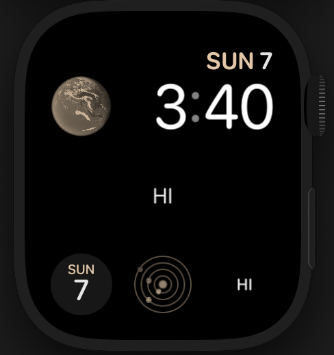

An example of adding a Widget, Watch App, and Watch App Complication in Expo's Managed Workflow (EAS).

| ios | watchos app | watchos complication|
|:-----------:|:------------:|:------------:|
||||

## Folders

- plugin: Config Plugins
- widget: Template files for widget
- watch: Template files for watch app
- complication: Template files for watch app complication

## Set up

### Install

`yarn install`


### Edit app.json

Edit following fields.

- `android.package`
- `ios.bundleIdentifier`
- `extra.eas.build.experimental.ios.appExtensions`
- `<APPLE_DEV_TEAM_ID>` in `plugins`

Update the entitlements file to match your app group you have enabled for your team. Otherwise disbale the entitlements 
sections to not use default app groups

## Run on Local

### iOS or Android App

```
yarn android
# or
yarn ios
```

### iOS Widget or WatchOS App + Complication

If you haven't yet, run `prebuild`

```bash
yarn prebuild
```

Then, if necessary, install pods

```bash
cd ios && pod install && cd ..
```

Then you can open the workspace in Xcode and run the app or widget target.

```bash
open ios/EASWidgetandWatchOSExample.xcworkspace
```

## TODO

- [x] Get shared files working between targets, whether just copying or actually copying once and sharing the file between targets
- [ ] Get Swift Package Manager working in extensions
